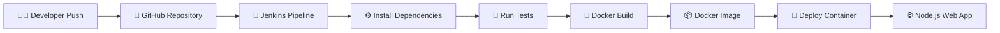

# 🚀 Node.js TO_DO App Project 🌐

<div align="center">

## ⚡ Full-Stack Node.js Application with CI/CD & Docker

### 🐳 Docker • 🔄 Jenkins • ⚡ Express • 🎨 EJS


<br/>
<br/>


</div>

---

# 🌟 Overview

A full-stack **Node.js TO-DO Application** built with:

- ⚡ Express.js
- 🎨 EJS Templating
- 🐳 Docker Containerization
- 🔄 Jenkins CI/CD Automation
- ☁️ GitHub Integration

This project demonstrates how to build and deploy a **modern Node.js application** using **DevOps best practices** and **CI/CD automation pipelines** 🚀

---

# ✨ Key Features

## 🖥️ Node.js Web Application

- ⚡ Built using Express.js
- 🎨 Dynamic EJS Templates
- 📂 Structured MVC-like project layout
- 📷 Static asset support

---

## 🔄 CI/CD Automation

- 🚀 Jenkins Declarative Pipeline
- 🔁 Automated Build & Test Workflow
- 🐳 Docker Image Automation
- ⚡ Continuous Integration Ready

---

## 🐳 Dockerized Deployment

- 📦 Dockerfile included
- ⚙️ Docker Compose support
- 🚀 Multi-container deployment ready
- ☁️ Easily deployable anywhere

---

## 🛡️ Security & Dependency Management

- 🔐 Dependabot integration
- 📦 Secure dependency upgrades
- 🧹 Clean `.gitignore` management

---

# 🏗️ Architecture Workflow



---

# 🧰 Tech Stack

| Category | Technologies |
|----------|--------------|
| ⚡ Backend | Node.js, Express.js |
| 🎨 Frontend | EJS Templates |
| 🐳 Containerization | Docker, Docker Compose |
| 🔄 CI/CD | Jenkins |
| 📦 Package Manager | npm |
| ☁️ Version Control | Git & GitHub |

---

# 📂 Project Structure

```bash
TO-DO_app-project/
│
├── views/                  # 🎨 EJS templates
├── .gitignore              # 🚫 Ignored files
├── Dockerfile              # 🐳 Docker image config
├── docker-compose.yaml     # ⚙️ Docker Compose setup
├── Jenkinsfile             # 🔄 Jenkins pipeline
├── README.md               # 📘 Documentation
├── abc.jpg                 # 🖼️ Static asset
├── app.js                  # ⚡ Main server file
├── package.json            # 📦 Dependencies
├── package-lock.json       # 🔒 Dependency lock
├── test.js                 # 🧪 Test cases
│
└── node_modules/
```

---

# 🚀 Getting Started

# 1️⃣ Clone Repository

```bash
git clone https://github.com/Gauravxo/TO-DO_app-project.git

cd TO-DO_app-project
```

---

# 2️⃣ Run Locally

```bash
npm install

node app.js
```

🌐 App runs at:

```bash
http://localhost:3000
```

---

# 3️⃣ Run with Docker

## 🐳 Build Docker Image

```bash
docker build -t node-ci-cd-app .
```

---

## 🚀 Run Docker Container

```bash
docker run -p 3000:3000 node-ci-cd-app
```

---

# 4️⃣ Run with Docker Compose

```bash
docker-compose up --build
```

---

# 🔄 Jenkins CI/CD Pipeline

This project includes a complete `Jenkinsfile` for:

✅ Build Automation  
✅ Test Execution  
✅ Docker Image Creation  
✅ Deployment Workflow  

---

# 🧪 Testing

Run tests locally using:

```bash
node test.js
```

Or integrate directly with Jenkins Pipeline 🚀

---

# 🛡️ Security Features

- 🔐 Dependabot Security Updates
- 📦 Dependency Vulnerability Fixes
- 🚫 Secure `.gitignore` Configuration

---

# 📦 Dependencies

| Package | Purpose |
|---------|----------|
| ⚡ Express.js | Backend framework |
| 🎨 EJS | Dynamic templating engine |
| 🔄 Nodemon | Development auto-reload |

---

# 🌐 Repository

🔗 GitHub Repository:

https://github.com/Gauravxo/TO-DO_app-project.git

---

# 👨‍💻 Author

## 🚀 Gaurav

- 🌐 GitHub: @Gauravxo

---

# 🤝 Contributing

Contributions are welcome 🚀

```bash
# Fork repository

# Create feature branch
git checkout -b feature/new-feature

# Commit changes
git commit -m "Add awesome feature"

# Push changes
git push origin feature/new-feature
```

Then open a Pull Request 🎉

---

# 📄 License

This project is licensed under the **MIT License**.

---

<div align="center">

# ⭐ Support

If you like this project, don't forget to ⭐ the repository!

### 🚀 Simple • Scalable • CI/CD Ready

</div>
